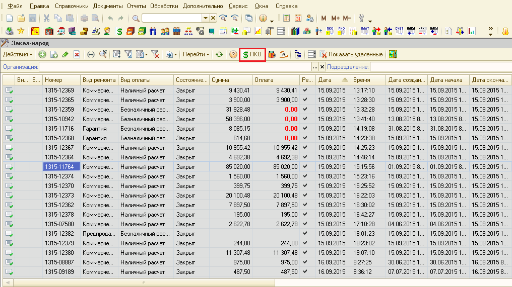

КАССЫ. ИНСТРУКЦИЯ № 1-03 от 29.11.2019
======================================

Основные правила печати кассовых чеков с использованием 1С: Альфа-Авто при работе с on-line кассами.
----------------------------------------------------------------------------------------------------

**Цель** – перечень действий при подготовке работы кассы и данных для
печати кассовых чеков.

1. Взаимодействия с кассовым аппаратом on-line производятся через 1С:
   Альфа-Авто.

2. Работа кассира в интерфейсе «Бухгалтер по кассе и банку».

..

   Если интерфейс не включен, то для переключения интерфейса нажать
   Сервис – Переключить интерфейс, выбрать строку «Бухгалтер по кассе и
   банку» и нажать ОК, (рисунок 1.)

   |image0|

   |image1|

   Рисунок 1. Переключение интерфейса

3. В начале дня Кассир открывает смену. Денежные средства в кассе
   отсутствуют.

4. Для открытия смены необходимо:

   1. Нажать кнопку «Фронт кассира», (рисунок 2);

..

   |image2|

   Рисунок 2. Кнопка включения «Фронта кассира».

2. В появившемся интерфейсе перейти на вкладку «Кассы», (рисунок 3.)

|image3|

   Рисунок 3. Вкладка «Касса» во «Фронте кассира».

3. Нажать кнопку «Открыть смену», (рисунок 4.)

4. Кассовый аппарат формирует распечатку «Отчёт об открытии смены»,
   (рисунок 5.)

|image4|

   Рисунок 4. Кнопка «Открыть смену» во «Фронте кассира».

   |image5|

   Рисунок 5. Отчёт об открытии смены.

5. Кассовый аппарат готов к работе, начинаем работать с приходными и
   расходными кассовыми ордерами и т.д.

5. Внесение оплаты в 1С: Альфа-Авто посредством ПКО.

   1. При оплате, ввести новый Приходно-кассовый ордер (ПКО).

   2. ПКО вводится на основании документа.

      1. Найти документ в журнале, (рисунок 6.)

..

   Нажать кнопку ПКО, или ввести ПКО по документу, (рисунок 7.)

   |image6|

   Рисунок 6. Журнал документов Заказ-наряд

   |image7|

   Рисунок 7. Внесение ПКО по Заказ-наряду.

3. Ввести в ПКО полученную в кассу сумму, проверить ставку и сумму НДС,
   проверить выставленную «Кассу компании», (рисунок 8.)

..

   Если есть необходимость - изменить реквизиты в соответствии с
   требованиями учёта.

   |image8|

   Рисунок 8. Проверка оформления Приходного кассового ордера.

4. Проверить, признак «Галочка» пробития на фискальном регистраторе и
   выбор кассы ККМ (реквизиты выставляются по умолчанию), (рисунок 9.)

..

   |image9|

   Рисунок 9. Указание кассы ККМ и признака пробития на фискальном
   регистраторе

5. Провести документ ПКО нажав кнопку |image10|.

6. Проверить ПКО в дереве связей документов и его привязку к документу,
   (рисунок 10.)

..

   |image11|

   Рисунок 10. Приходный кассовый ордер в дереве связей документов.

6. По окончании работы с документом ПКО и проведения ПКО сообщить
   кассовому аппарату о принятых денежных средствах клиента:

   1. Нажать кнопку «Оплата» в ПКО, (рисунок 11.)

..

   |image12|

   Рисунок 11. Кнопка «Оплата» в Приходном кассовом ордере.

2. При печати кассового чека проверить в интерфейсе, наименование
   платежа, например: «Оплата за услуги по техническому обслуживанию по
   заказ-наряду № … (номер заказ-наряда) от … (дата заказ-наряда)»,
   «Аванс за услуги по техническому обслуживанию», ставку НДС и сумму,
   которую принимаем от клиента, рисунок 12.

..

   |image13|

   Рисунок 12. Подготовка печати кассового чека.

3. Проверить, наименования платежа сути: аванс или зачёт аванса при
   проведении полного расчёта.

..

   Произвести анализ дерева связей документов; историю взаиморасчётов с
   контрагентом; обратиться к ответственному лицу, оформлявшему сделки
   (сервисному консультанту, продавцу-консультанту и т.д.) при
   необходимости.

4. Проверить СНО (систему налогообложения). При ошибке произвести
   перевыбор системы налогообложения, нажав на |image14|\ и выбрав из
   списка

..

   |image15|.

   Выяснить у клиента, каким способом вносится оплата: наличными
   средствами или электронным платежом через банковскую карту в
   терминале.

   Если наличными, нажать кнопку «Наличные».

   Электронная оплата, указываем «Карточкой», рисунок 13. Нажатая кнопка
   подсветится зелёным цветом. При выборе не той кнопки, нажать другую
   кнопку, при этом сработает кнопка выделенная зелёным цветом.

   |image16|

   Рисунок 13. Выбор способа оплаты для печати Кассового чека.

5. Чек на печать - нажатием «Пробитие чека», рисунок 14.

..

   До нажатия «Пробитие чека» чек не печатается. Если до нажатия
   пробития обнаружены какие-то ошибки, зарыть фронт кассира, нажав
   |image17| в правом верхнем углу - появляется возможность работы с
   ПКО.

   |image18|

   Рисунок 14. Кнопка Пробития чека.

6. После печати Кассового чека «Фронт кассира» закрывается
   автоматически.

..

   Если «Фронт кассира» не закрылся, необходимо его закрыть
   принудительно, нажав на |image19| в правом верхнем углу, (рисунок
   13):

7. При совмещении оплаты документа: «наличная оплата» и «электронная» (с
   использованием банковской карточки) необходимо создать два ПКО:

..

   - один с указанием суммы по наличной оплате;

   - второй с суммой по электронной оплате.

8. Запрещается вводить ПКО и РКО без документа основания, кроме
   исключительных случаев. Необходимо вводить ПКО и РКО только на
   основании документа, который оплачивается. Документы основания:

-  Заказ-наряд;

-  Заказ клиента на автомобиль;

-  Реализация товаров;

-  Договор аренды автомобиля;

-  Платный договор хранения (шин);

-  Заказ и резервирование покупателя;

-  Акт об оказании услуг;

-  Договор страхования;

-  Продажа ПТО;

-  Договор на доп. услуги:

..

   - Договор на продление гарантии;

   - Хранение автомобилей;

   - Помощь на дороге SARA;

   - Сервисный контракт;

   Запрещается вводить ПКО на основании:

-  Заказ автомобиля на склад.

9.  Если ПКО вводится без документа основания, то в кассовый чек
    наследуется текст из поля «Основание» приходно-кассового ордера.

10. При внесении оплаты за несколько документов сразу необходимо водить
    ПКО по каждому закрываемому документу отдельно.

11. В конце дня закрыть кассовую смену. Необходимо открыть фронт
    кассира, нажатием соответствующей кнопки, рисунок 2. На вкладке
    Касса запустить Z-отчёт, (рисунок 15.) Результат вывода Z-отчёта
    представлен на рисунке 16.

..

   |image20|

   Рисунок 15. Кнопка вызова Z-отчёта.

   |image21|

   Рисунок 16. Z-отчёт

12. **Кассовые чеки с признаками «Расход», «Возврат расхода» и «Возврат
    прихода».**

    1. При пробитии кассовых чеков применяются 4 признака расчёта:

..

   «Приход»; «Возврат прихода»;

   «Расход»; «Возврат расхода».

2. Признак расчёта «\ **Приход**\ » (поступление средств от покупателя
   (клиента)) появляется, если Кассовый Чек пробивается из
   **приходно-кассового ордера** (ПКО) и признак-галочка «\ **Возврат
   расхода**\ » **НЕ установлен**.

3. При возврате денежных средств клиенту, необходимо пробивать Кассовый
   Чек с признаком **«Возврат прихода»** (независимо от даты возврата).

..

   Признак расчёта «\ **Возврат прихода**\ » (возврат покупателю
   (клиенту) средств) появляется, если Кассовый Чек пробивается из
   **расходно-кассового ордера** (РКО) и признак-галочка
   «\ **Расход**\ » **НЕ установлен**.

4. Когда клиент получает деньги из кассы организации, за поставленный
   товар (услугу), необходимо пробивать Кассовый Чек с признаком
   **«Расход»**.

..

   Если поставленный товар, например, автомобиль, сдаётся в зачёт вновь
   приобретаемого автомобиля, необходимость пробития Кассового Чека с
   признаком **«Расход»** определяется необходимостью выдачи денежных
   средств из кассы по договору сделки.

   Признак расчёта «\ **Расход**\ » (выдача средств клиенту) появляется,
   если Кассовый Чек пробивается из **расходно-кассового ордера** (РКО)
   и признак-галочка «\ **Расход**\ » **установлен**.

5. Если клиент возвращает ранее выданные ему деньги за товар (услугу)
   пробиваем Кассовый Чек с признаком расчёта **«Возврат расхода»**.

..

   Признак расчёта «\ **Возврат расхода**\ » (получение средств от
   клиента, выданных ему) появляется во фронте кассира, если Кассовый
   Чек пробивается из **приходно-кассового ордера** (РКО) и
   признак-галочка «\ **Возврат расхода**\ » **установлен**.

6. Для получения разъяснений по ведению кассового учёта кассиру
   необходимо обратиться к Главному бухгалтеру Автоцентра и уточнить, в
   каких случаях пробивать Чек с признаком «Расход», «Возврат расхода» и
   «Возврат прихода».

7. Условия формирования «Признака расчёта» представлены в таблице:

+-------+-------------------+-------------------+-------------------+
| № п/п | Признак расчёта   | Документ          | Дополнительный    |
|       |                   |                   | признак-галочка   |
+=======+===================+===================+===================+
| 1     | «Приход»          | Приходно-кассовый | Не установлен     |
|       |                   | ордер             |                   |
+-------+-------------------+-------------------+-------------------+
| 2     | «Возврат прихода» | Расходно-кассовый | Не установлен     |
|       |                   | ордер             |                   |
+-------+-------------------+-------------------+-------------------+
| 3     | «Расход»          | Расходно-кассовый | Установлен        |
|       |                   | ордер             | признак «Расход»  |
+-------+-------------------+-------------------+-------------------+
| 4     | «Возврат расхода» | Приходно-кассовый | Установлен        |
|       |                   | ордер             | признак «Возврат  |
|       |                   |                   | расхода»          |
+-------+-------------------+-------------------+-------------------+

8. Если нужно пробить чек с Признаком расчёта «Расход» необходимо в
   Расходно-кассовом ордере выставить признак-галочку «Расход», рисунок
   17.

|image22|

Рисунок 17. Признак «Расход» в расходно-кассовом ордере

9. Если нужно пробить Чек с Признаком расчёта «Возврат расхода»
   требуется в Приходно-кассовом ордере выставить признак-галочку
   «Возврат расхода», рисунок 18.

|image23|

Рисунок 18. Признак «Возврат расхода» в приходно-кассовом ордере

10. Признаки расчёта отображаются во фронте кассира в поле «Тип
    расчёта», (рисунок 19.)

..

   Во фронте кассира поле носит информационный характер и недоступно для
   изменения.

11. При переходе к фронту кассира проверить Признак расчёта в поле «Тип
    расчёта». На рисунке 19 представлено пробитие Чека с Признаком
    расчёта «Расход».

..

   Выбрать, а при отсутствии в списке «Наименования предмета расчёта»,
   ввести его вручную с клавиатуры.

   Пробить Чек. Проверить на Кассовом Чеке появление Признака расчёта
   «Расход».

   |image24|

Рисунок 19. Пробитие кассового чека с признаком «Расход».

12.12. При появлении в приходно-кассовом ордере признака «Возврат
расхода» во фронте кассира должен появиться Тип расчёта «Возврат
расхода».

   Выбрать, а при отсутствии в списке «Наименования предмета расчёта»,
   ввести его вручную с клавиатуры.

   Пробить Чек. Проверить на кассовом чеке появление Признака расчёта
   «Возврат расхода».

13. **Проверка возможности пробития кассовых чеков с признаками «Расход»
    и «Возврат прихода».**

    1. Пробитие Кассовых Чеков с признаками «Расход» и «Возврат прихода»
       зависит от наличия денежных средств в ККТ.

    2. Имеется техническая возможность отключения Контроля наличности.
       Решение об отключение контроля наличности принимает Главный
       бухгалтер. Отключение производится через утилиту тест драйвера.
       Для проведения данного действия необходимо обратиться в отдел ИТС
       ДТР по телефону 8 (846) 929 - 38 - 02.

    3. Реализация функций «Расход» и «Возврат прихода» при отсутствии
       наличности в денежном ящике в ККТ **запрещены** по причине
       отрицательного значения счётчика наличности в денежном ящике.

    4. Если денежных средств в ККТ недостаточно для проведения выплаты,
       Кассовый Чек не пробивается, выдаётся сообщение на печатной форме
       чека «Чек аннулирован». Такой Чек не считается действительным и
       не отправляется в ОФД, рисунок 20.

..

   |image25|

   Рисунок 20. Кассовый чек «Аннулирован»

5. При пробитии Кассовых Чеков с признаками «Расход» и «Возврат прихода»
   необходимо первоначально произвести снятие Х-отчёта (Отчёт о
   состоянии счётчиков ККТ без гашения), рисунок 21.

..

   |image26|

   Рисунок 21. Снятие Х-отчёта.

6. По снятому Х-отчёту определить наличие в ККТ суммы для проведения
   выплаты, рисунок 22. Эта проверка актуальна при проведении выплаты,
   по наличной форме оплаты. Если в денежном ящике сумма меньше, чем
   необходимо вернуть покупателю, выполнить операцию возврата не
   возможно.

7. Счётчик наличности в кассе изменяется только при операциях, где
   присутствует тип платежа «Наличными». Операции «ПРИХОД», «ВОЗВРАТ
   РАСХОДА», «ВНЕСЕНИЕ» – увеличивает сумму наличных денег в кассе.
   Операции «РАСХОД», «ВОЗВРАТ ПРИХОДА», «ВЫПЛАТА» – уменьшают сумму
   наличности в кассе, рисунок 22.

8. Если расходные операции «ВОЗВРАТ ПРИХОДА» и «РАСХОД» проводить с
   типом оплаты «Безналичные», то счётчик ККТ «НАЛИЧНОСТЬ» не изменится
   при таких операциях. Изменится общий счётчик выручки «ВЫРУЧКА» и
   счётчики «СМЕННОГО ИТОГА» по операциям «ВОЗВРАТ ПРИХОД» и «РАСХОД».

..

   |image27|

   Рисунок 22. Х-отчёт (отчёт о состоянии счётчиков ККТ без гашения)

9. После проведения проверки, если денежных средств достаточно,
   пробиваем Кассовый Чек с признаком «Расход» или «Возврат прихода».

14. **Выбор Кассы компании при разных видах оплаты.**

    1. Вид оплаты в справочнике «Кассы компании» заполняется, если
       необходимо разделять денежные потоки на Автоцентре по видам
       оплаты. Настройку производят программисты (системные
       администраторы).

    2. При формировании платежного документа («Приходно-кассовый ордер»
       или «Расходно-кассовый ордер») реквизит документа «Касса
       компании», (рисунок 23) по умолчанию заполняется элементом
       справочника «Касса компании», который в «Правах и настройках»
       отмечен как «Основная касса», вне зависимости от вида оплаты в
       этом элементе.

    3. Если в «Правах и настройках» не указана Основная касса, то
       автоматически выбирается касса, у которой вид оплаты
       «Произвольная оплата» либо данный реквизит не заполнен. Далее
       будет выбираться касса компании с Наличным видом оплаты. Не
       отмеченная как Основная Касса компании с Безналичным видом оплаты
       выбирается только вручную.

    4. Если вид оплаты в элементе справочника «Кассы компании» =
       «Произвольная оплата» или «Пусто», то во Фронте кассира будут
       доступны для выбора обе кнопки выбора вида оплаты («Наличные»
       либо «Карточкой»), рисунок 23.

..

   |image28|

   Рисунок 23. ПКО и Фронт кассира при отсутствии необходимости
   разделять

   денежные потоки по видам оплаты.

5. Если выбран элемент справочника «Кассы компании», у которого вид
   оплаты равен «Наличный расчет», тогда во Фронте кассира доступна для
   выбора одна кнопка оплаты «Наличные», (рисунок 24.).

..

   |image29|

   Рисунок 24. ПКО и Фронт кассира при приеме наличных платежей

6. Когда Виды оплаты в справочнике «Кассы компании» настроены, и Клиент
   намерен оплатить услуги с использованием банковской карты, кассир в
   приходно-кассовом ордере должен вручную изменить реквизит «Касса
   компании» на значение кассы с видом оплаты «Безналичный расчет»
   (Рисунок 25).

7. Касса компании с видом оплаты «Безналичный расчёт» выбирается
   вручную, тогда во Фронте кассира доступна для выбора одна кнопка вида
   оплаты «Карточкой».

..

   |image30|

   Рисунок 25. ПКО и Фронт кассира при приеме оплаты посредством

   использования банковской карты

15. **Отправка кассовых чеков по электронной почте и SMS сообщением.**

..

   Для отправки Кассового Чека кассиру необходимо во фронте кассира
   перейти на закладку «Покупатель», рисунок 26.

   |image31|

Рисунок 26. Закладка «Покупатель» во фронте кассира

   15.1. В открывшемся интерфейсе внести в поле «E-mail» электронный
   адрес клиента (отправить данные по чеку на его электронную почту).

   15.2. Внести в поле «Телефон» телефонный номер клиента (отправить
   данные по чеку на его абонентский номер).

   При отправлении данных по Кассовому Чеку на электронную почту и
   абонентский номер, должны быть заполнены поля, рисунок 27.

   |image32|

Рисунок 27. Заполнение полей E-mail и телефон

   Если в карточке Контрагента содержатся телефонные номера и адреса
   электронной почты, то их можно выбрать непосредственно из списка,
   нажав кнопку |image33|, рисунок 28.

|image34|

Рисунок 28. Выбор электронной почты при наличии в карточке контрагента

   Заполнение полей производим **ДО** пробития Кассового Чека.

   Заполненный адрес электронной почты клиента и/или абонентский номер
   клиента наследуется в Кассовый Чек.

   15.3. Отправка данных по Кассовому Чеку осуществляется двумя
   способами:

   - посредством настроек в системе 1С;

   - посредством оформления договора в ОФД.

   Настройка отправки электронной почты и отправки на абонентский номер
   клиента осуществляется системными администраторами по инструкции,
   расположенной в сети Интернет по адресу:
   https://yadi.sk/d/fm3nrIbvsmVXV.

   Данные по Кассовому Чеку, отправляемые через 1С содержат следующую
   информацию:

   - Регистрационный номер ККТ;

   - Сумма расчёта, указанного в чеке (БСО);

   - Дата, время;

   - ФПД;

   - Сайт чеков.

16. **Фамилия кассира в кассовом чеке.**

..

   Во фронте кассира в поле «Кассир» выводится текущий пользователь
   (фамилия сотрудника из справочника сотрудников, привязанная к
   текущему пользователю), данное поле недоступно для изменения,
   (рисунок 29.)

   |image35|

Рисунок 29. Поле «Кассир» во фронте кассира

Устанавливается фамилия того лица, под которым зашли в программу 1С.

Данные из поля наследуются в кассовый чек в поле Кассир. Перед пробитием
Кассового Чека кассир должен убедиться, что фамилия (Фамилия, Имя)
указывается правильно.

При отображении в поле неверных данных необходимо обратиться к
системному администратору (программисту).

При наличии на Автоцентре более одной организации необходимо согласовать
с Главным бухгалтером автоцентра, по каким организациям кассиры с какими
фамилиями имеют право пробивать кассовые чеки.

17. **Реализация автомобилей Trade-in. Оформление авансов при реализации
    автомобилей, приобретённых у физических лиц.**

..

   Описание данного раздела подробно представлено в разделе 13 процедуры
   Кассы. Процедура № 3 «Применение кассового чека отгрузки при
   оформлении продажи автомобиля с использованием ФФД 1.05».

18. **История изменений с 01.11.2017**

+-----------+-----------------+-----------------+-----------------+
| **Номер** | **Измененные    | **Описание      | **Версия        |
|           | разделы**       | изменений**     | утвержденного   |
|           |                 |                 | документа       |
|           |                 |                 | (дата)**        |
+===========+=================+=================+=================+
|           |                 | Основное        | 01 (27.10.2017) |
|           |                 | наполнение      |                 |
|           |                 | документа       |                 |
+-----------+-----------------+-----------------+-----------------+
|           |                 | Внесены         | 02 (09.11.2017) |
|           |                 | многочисленные  |                 |
|           |                 | правки по       |                 |
|           |                 | тексту          |                 |
+-----------+-----------------+-----------------+-----------------+
|           |                 | 1.              | 03 (29.11.2019) |
|           |                 | Скорректирована |                 |
|           |                 | формулировка п. |                 |
|           |                 | 6.2, изменён    |                 |
|           |                 | рисунок 12, 13  |                 |
|           |                 | из-за изменения |                 |
|           |                 | наименования    |                 |
|           |                 | предмета        |                 |
|           |                 | расчёта «Оплата |                 |
|           |                 | за услуги по    |                 |
|           |                 | техническому    |                 |
|           |                 | обслуживанию»   |                 |
|           |                 | на «Оплата за   |                 |
|           |                 | услуги по       |                 |
|           |                 | техническому    |                 |
|           |                 | обслуживанию по |                 |
|           |                 | … *(номер       |                 |
|           |                 | заказ-наряда)*  |                 |
|           |                 | от … *(дата     |                 |
|           |                 | зак             |                 |
|           |                 | аз-наряда)*\ »; |                 |
|           |                 |                 |                 |
|           |                 | 2. Изменён      |                 |
|           |                 | рисунок 14 и п. |                 |
|           |                 | 6.5. из-за      |                 |
|           |                 | упразднения     |                 |
|           |                 | кнопки «Отмена  |                 |
|           |                 | операции»;      |                 |
|           |                 |                 |                 |
|           |                 | 3. Расширен     |                 |
|           |                 | список          |                 |
|           |                 | документов в    |                 |
|           |                 | разделе 8:      |                 |
|           |                 | Договором       |                 |
|           |                 | страхования;    |                 |
|           |                 | Продажей ПТО;   |                 |
|           |                 | Договором доп.  |                 |
|           |                 | услуг;          |                 |
|           |                 |                 |                 |
|           |                 | 4. Разделы 12 и |                 |
|           |                 | 13 объединены;  |                 |
|           |                 |                 |                 |
|           |                 | 5. Раздел       |                 |
|           |                 | «Реализация     |                 |
|           |                 | автомобилей     |                 |
|           |                 | Trade-in.       |                 |
|           |                 | Оформление      |                 |
|           |                 | авансов при     |                 |
|           |                 | реализации      |                 |
|           |                 | автомобилей,    |                 |
|           |                 | приобретённых у |                 |
|           |                 | физических лиц» |                 |
|           |                 | выведен из      |                 |
|           |                 | состава данной  |                 |
|           |                 | инструкции;     |                 |
|           |                 |                 |                 |
|           |                 | 6. Заменены     |                 |
|           |                 | рисунки 3-8;    |                 |
|           |                 | 10-16; 19; 21;  |                 |
|           |                 | 23-29 в связи с |                 |
|           |                 | изменением      |                 |
|           |                 | интерфейса      |                 |
|           |                 | фронта кассира, |                 |
|           |                 | внешнего вида   |                 |
|           |                 | фискальных      |                 |
|           |                 | документов.     |                 |
+-----------+-----------------+-----------------+-----------------+

.. |image0| image:: instr1_image/media/image1.png
   :width: 6.94792in
   :height: 2.4375in

.. |image14| image:: instr1_image/media/image15.png
   :width: 0.22917in
   :height: 0.28125in

.. |image17| image:: instr1_image/media/image18.png
   :width: 0.15625in
   :height: 0.14792in
.. |image18| image:: instr1_image/media/image19.png
   :width: 5.84583in
   :height: 1.37778in
.. |image19| image:: instr1_image/media/image20.png
   :width: 0.15625in
   :height: 0.14792in

.. |image21| image:: instr1_image/media/image22.png
   :width: 2.78403in
   :height: 9.97153in

