Кассы. ИНСТРУКЦИЯ № 2-02 от 25.10.2019
=======================================

Зачет оплат на другие сделки путем формирования документа «Взаимозачет»
------------------------------------------------------------------------

Создание документа «Взаимозачет» на примере двух сделок по заказу /
реализации автомобиля. Аналогичные действия для документов, для которых
требуется «перераспределить» внесенные денежные средства на другие
сделки (контрагенты).

1 сделка:

-  Создан документ «Заказ клиента на автомобиль» № 0000000015 от 05.04.2017;

-  Контрагент - ЯЩУРИНСКИЙ ИВАН ВАСИЛЬЕВИЧ;

-  Договор взаиморасчетов – «Договор купли/продажи автомобиля»;

-  Автомобиль - RAV4 VIN 12332132132132132;

-  Стоимость автомобиля - 1 215 000 руб.;

-  Предоплата по заказу – 50 000 руб.;

-  Документ предоплаты – Приходно-кассовый ордер № 1300000045 от
   05.05.2017.

Дерево связей выглядит таким образом:

|image0|

Взаиморасчеты с контрагентом выглядят таким образом:

|image1|

2 сделка:

-  Создан документ «Заказ клиента на автомобиль» № 0000000016 от
   05.04.2017;

-  Контрагент - ЯЩЕНКО ЮЛИЯ АЛЕКСАНДРОВНА;

-  Договор взаиморасчетов – «Продажа в Руб от 05.06.14»;

-  Автомобиль - LC200 VIN JTMCV05J704170316;

-  Стоимость автомобиля - 1 300 000 руб.;

-  Предоплата по заказу – отсутствует.

Дерево связей по сделке выглядит следующим образом:

|image2|

СИТУАЦИЯ: Контрагент ЯЩУРИНСКИЙ ИВАН ВАСИЛЬЕВИЧ отказался от сделанного
заказа на автомобиль и попросил перевести авансовый платеж на
контрагента ЯЩЕНКО ЮЛИЮ АЛЕКСАНДРОВНУ.

Действия пользователей 1С должны быть следующие:

1. Создать документ «Взаимозачет» для зачета денежных средств,
      уплаченных ЯЩУРИНСКИМ ИВАНОМ ВАСИЛЬЕВИЧЕМ, в пользу контрагента
      ЯЩЕНКО ЮЛИИ АЛЕКСАНДРОВНЫ.

..

   Для этого:

1. Открыть документ «Заказ клиента на автомобиль № 0000000016» с
   контрагентом ЯЩЕНКО ЮЛЕЙ АЛЕКСАНДРОВНОЙ;

2. Вводом на основании открыть документ «Взаимозачет»

|image3|

3. В открывшемся документе «Взаимозачет», путем подбора элементов
   справочника «Контрагенты», заполнить поля «Дебитор» (контрагент, в
   пользу которого зачитываются денежные средства) и «Кредитор»
   (контрагент, денежные средства которого принимаются к зачету).

|image4|

4. По кнопке |image5| в документе открыть табличную часть и заполнить
   поля:

-  Сделка дебитора. По кнопке |image6| открыть список видов документов,
   в рамках которых могла бы быть осуществлена сделка Дебитора, выбрать
   нужный вид документа и в открывшемся журнале выбрать необходимый
   документ. В нашем случае это «Заказ клиента на автомобиль» №
   0000000016 от 05.04.2017 на ЯЩЕНКО ЮЛИЮ АЛЕКСАНДРОВНУ.

|image7|

-  Договор дебитора. Поле заполняется автоматически после заполнения
   поля «Сделка дебитора» ссылкой на договор взаиморасчетов, находящийся
   в документе сделки дебитора.

|image8|

-  Сделка кредитора (вторая строчка). По кнопке |image9| открыть список
   видов документов, в рамках которых могла быть осуществлена сделка
   Кредитора, выбрать нужный вид документа и в открывшемся журнале
   выбрать необходимый документ. В нашем случае «Приходно-кассовый ордер
   № 1300000045» от 05.05.2017 на ЯЩУРИНСКОГО ИВАНА ВАСИЛЬЕВИЧА.

|image10|

-  Договор кредитора. Поле заполняется автоматически после заполнения
   поля «Сделка кредитора» ссылкой на договор взаиморасчетов, который
   есть в документе сделки кредитора.

|image11|

-  Сумма. Внести сумму, принимаемую к зачету. Документ «Взаимозачет»
   допускает принимать к зачету как полную сумму произведенных платежей,
   так и частичную.

|image12|

1. После заполнения всех полей провести документ по кнопке |image13| .

2. Проверить дерево связей по контрагенту-дебитору. В нем должен
   появиться документ «Взаимозачет».

|image14|

3. Отменить резерв автомобиля RAV4 VIN 12332132132132132 путем создания
   документа «Снятие резервов автомобиля».

|image15|

4. Далее по операции «Продажа автомобилей» пользователи создают документ
   «Реализация автомобиля и дерево связей будет выглядеть таким образом:

|image16|

5. Записи в регистре «Взаиморасчеты компании» при проведении
   взаиморасчетов по контрагентам должны выглядеть :

|image17|

**ИТОГ**: у компании и ЯЩУРИНСКОГО ИВАНА ВАСИЛЬЕВИЧА нет взаимных
задолженностей, а относительно взаиморасчетов между компаний и ЯЩЕНКО
ЮЛИЕЙ АЛЕКСАНДРОВНОЙ возникает задолженность контрагента перед компанией
по документу отгрузки «Реализация автомобилей № 0000000009» в размере
1 250 000 руб.

6. История изменений с 01.11.2017

+-----------+-----------------+-----------------+-----------------+
| **Номер** | **Измененные    | **Описание      | **Версия        |
|           | разделы**       | изменений**     | утвержденного   |
|           |                 |                 | документа       |
|           |                 |                 | (дата)**        |
+-----------+-----------------+-----------------+-----------------+
|           |                 | Основное        | 01 (07.04.2017) |
|           |                 | наполнение      |                 |
|           |                 | документа       |                 |
+-----------+-----------------+-----------------+-----------------+
|           |                 | Внесены правки  | 02 (25.10.2019) |
|           |                 | по тексту       |                 |
+-----------+-----------------+-----------------+-----------------+
|           |                 |                 |                 |
+-----------+-----------------+-----------------+-----------------+

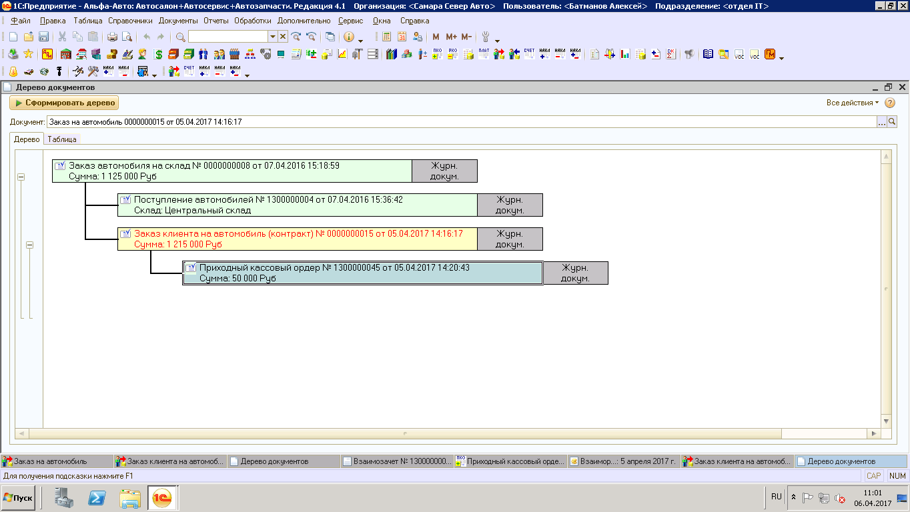
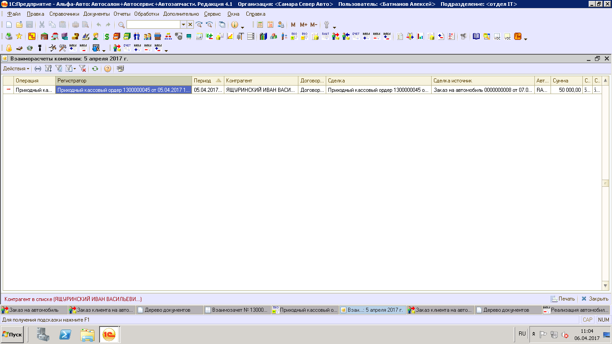
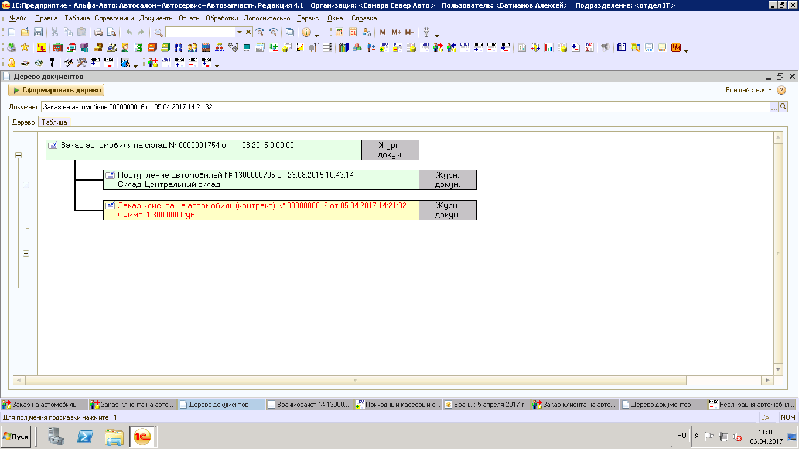
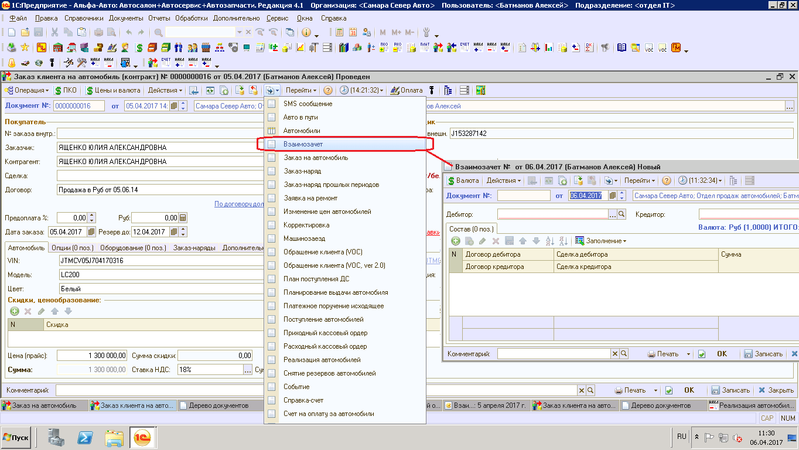
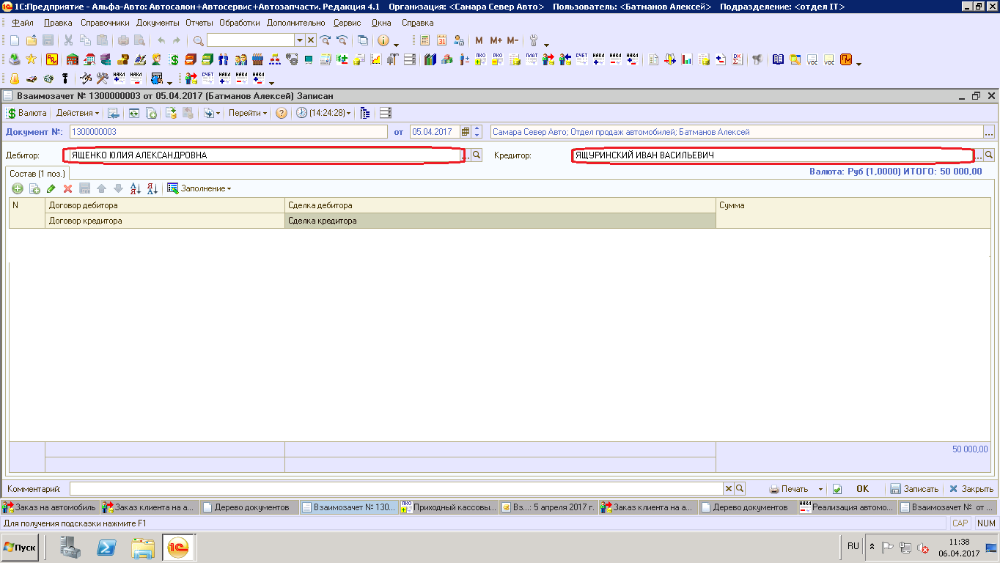

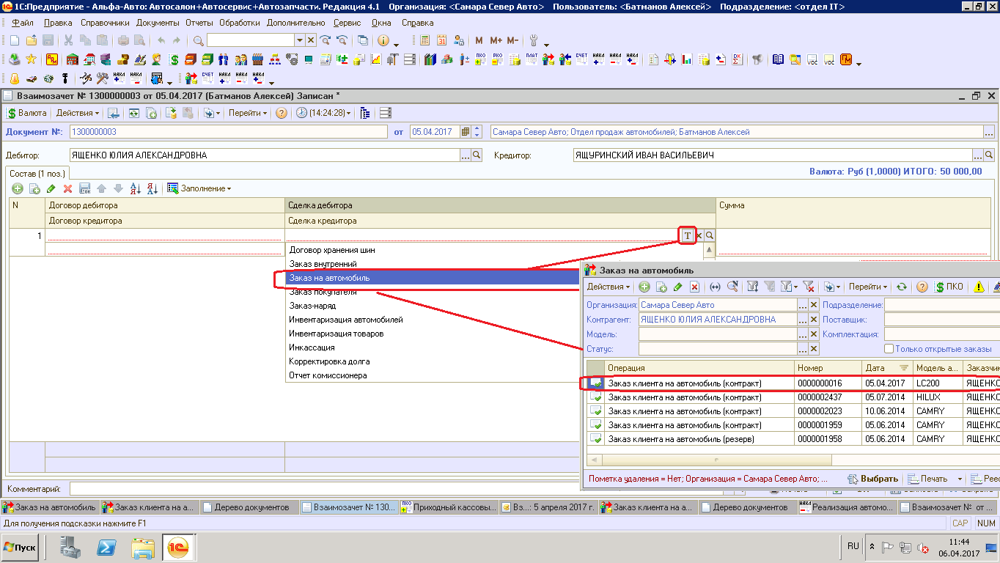
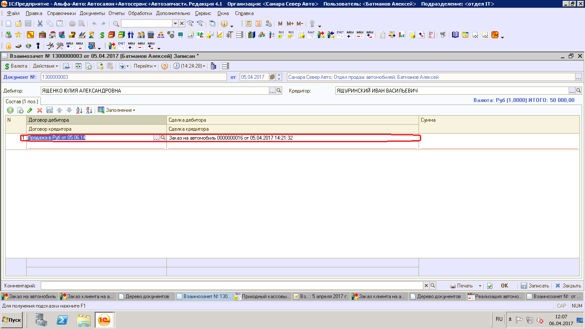

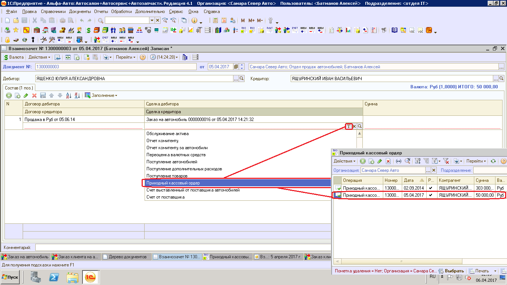
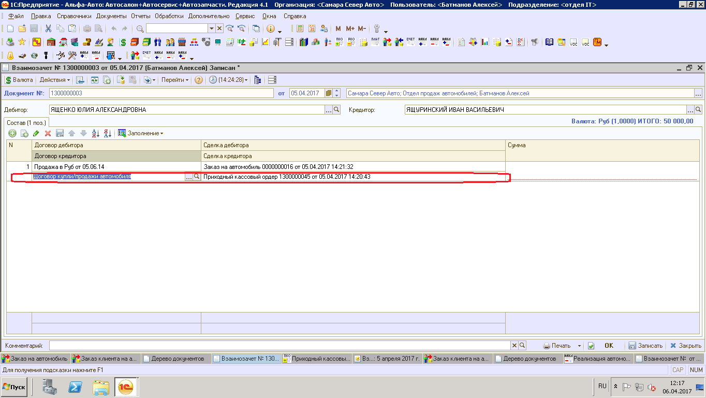
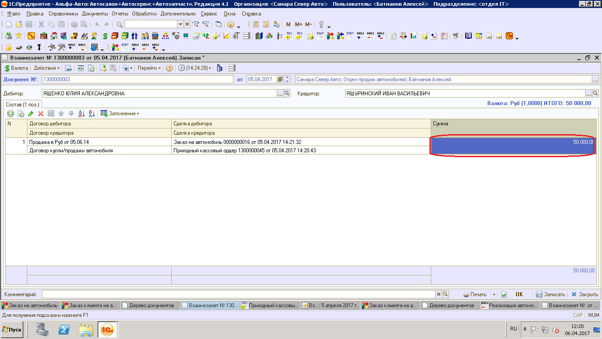

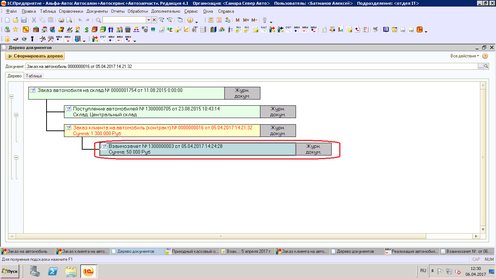
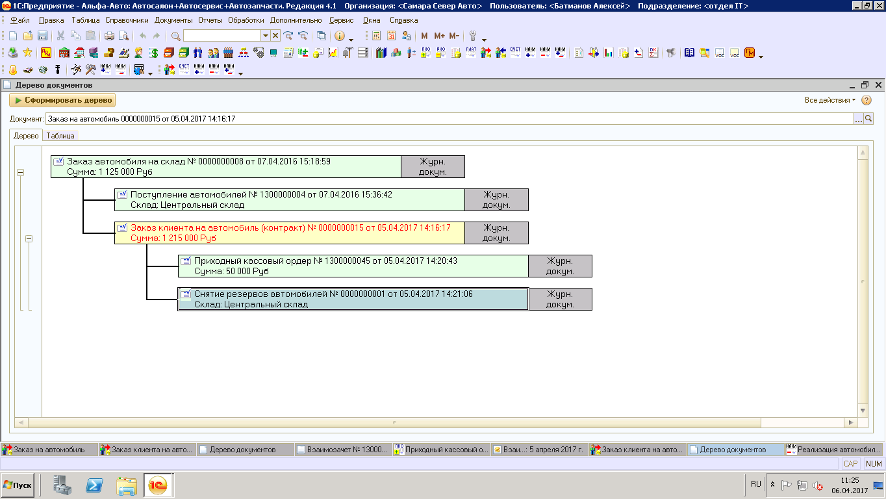
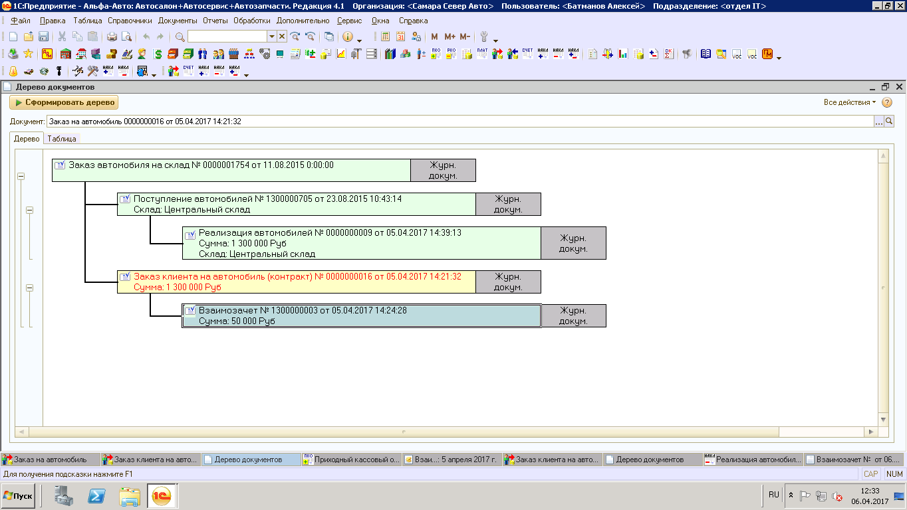
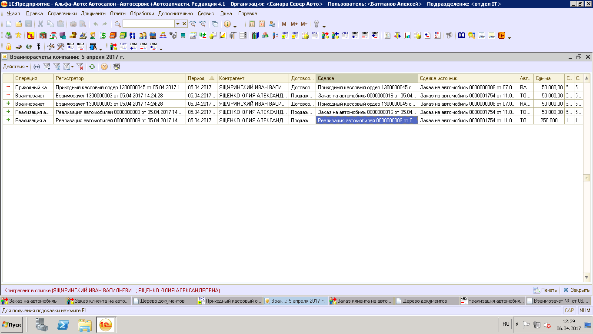
