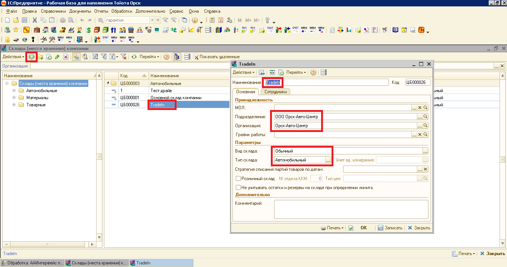
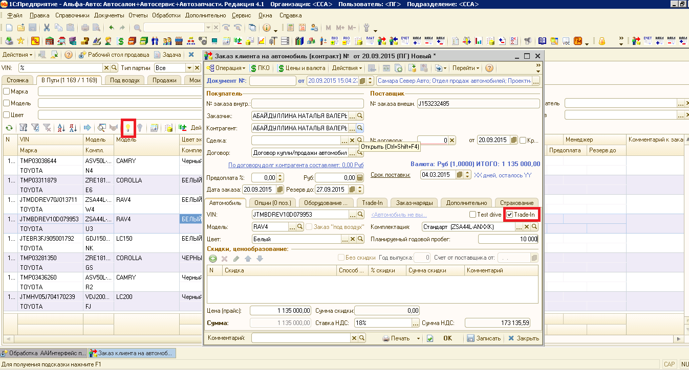
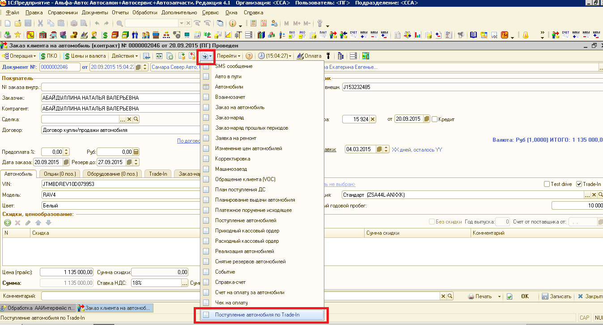
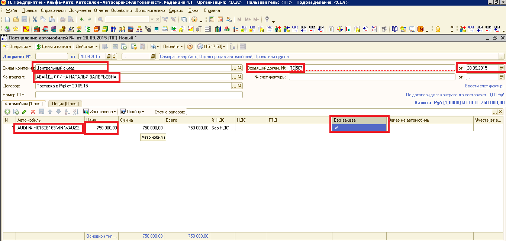
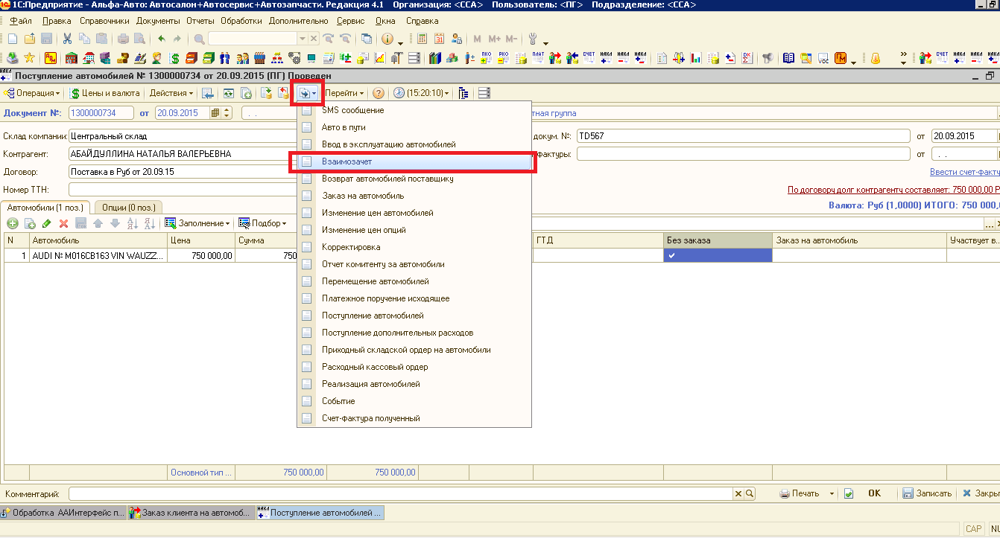
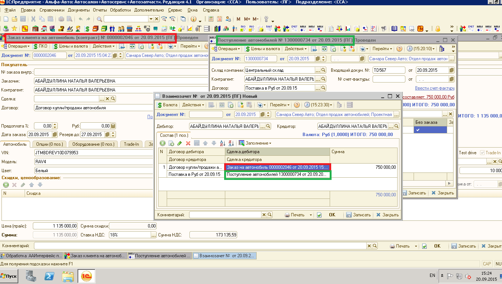
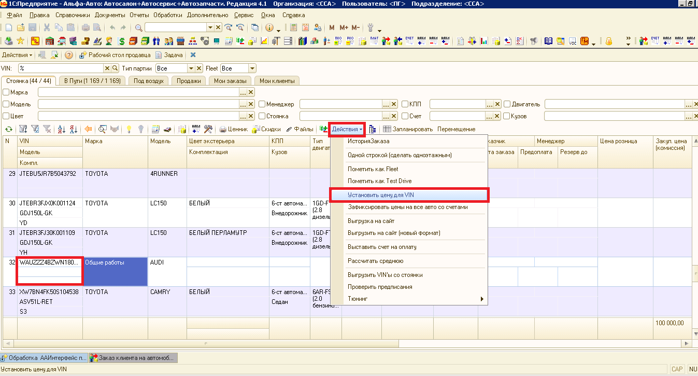
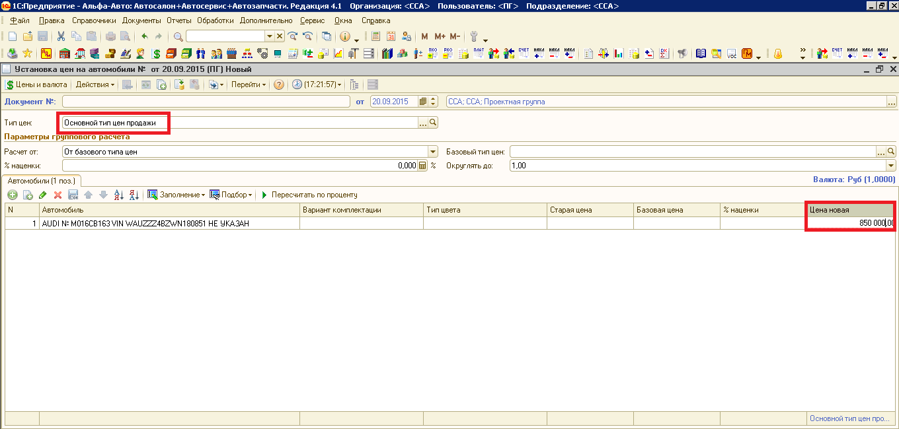

Кассы. ИНСТРУКЦИЯ № 3-02 от 28.10.2019
======================================

Схема оформления автомобилей по Trade-in.
-----------------------------------------

1. Завести Автомобильный склад Трейд-ин и там приходовать автомобили по
   Трейд ин .

|image0|

2. Создать Заказ Клиента на автомобиль (клиента) по новому автомобилю,
   когда Клиент, берет новое авто и сдает в трейд-ин старое авто.

При оформлении Заказа в нем необходимо выставить «Галочку» трейд –ин,
появится закладка Трейд-ин в Заказе. Записать и провести Заказ клиента
на автомобиль.

|image1|

3. Ввести на основании Заказа клиента документ «Поступление автомобиля
   по трейд-ин».

В документ «Поступление (трейд-ин)» ввести приходуемый автомобиль (при
отсутствии создать в справочнике Автомобилей).

|image2|

4. При создании Поступления трейд-ин Контрагентом выбираем покупателя
   нового автомобиля. Выбрать склад «Трейд Ин», в табличной части
   указать, что поступление без заказа. Указать цену поступления
   автомобиля.

Автомобиль поступает от частного лица, то Поступление **без НДС.**

Автомобиль поступает от Юр. лицо , то Поступление **с НДС**

**Важно ! УТОЧНИТЬ в БУХГАЛТЕРИИ по вопросу оприходования авто с НДС или
без..**

|image3|

5. В документе «Поступление автомобиля Трейд ин» нажать кнопку ввести на
   основании и ввести документ «Взаимозачет».

|image4|

6. В документе «Взаимозачет» в ячейке «Сделка дебитора» должен быть
   Заказ клиента на продаваемый нами новый автомобиль.

«Сделка кредитора» должно быть поступление у нас трейд ин автомобиля (
зачет при покупке нового автомобиля).

|image5|

7. После Поступления авто трейд-ин появится на стоянке на «складе трейд
   –ин» и готово к продаже .

8. Цена на поступивший автомобиль трейд-ин устанавливается - «Установкой
   цен на VIN» либо вручную при создании Заказа клиента на автомобиль.

|image6|

|image7|

9. В документе Реализация авто Трейд-ин, НДС устанавливаем:

- НДС должно начисляться на межценовую разницу( цена реализации минус
стоимость поступления авто трейд-ин), если авто поступило от физ. лица;

- НДС начисляем со всей стоимости автомобиля, как на новые товарные
автомобили ( авто поступило от юр. лица) .

10. История поступления авто нового и его продажа и авто трейд-ин,
    полученное в зачет будут находиться в одной ветке дерева связей
    документов.

11. Реализация нового авто по общей схеме (см. Процедуру. ПРОДАЖИ.
    ПР-02-01 Оформление продажи и выдача автомобиля).

12. **История изменений с 01.11.2017**

+-----------+-----------------+-----------------+-----------------+
| **Номер** | **Измененные    | **Описание      | **Версия        |
|           | разделы**       | изменений**     | утвержденного   |
|           |                 |                 | документа       |
|           |                 |                 | (дата)**        |
+===========+=================+=================+=================+
|           |                 | Основное        | 01 (26.04.2017) |
|           |                 | наполнение      |                 |
|           |                 | документа       |                 |
+-----------+-----------------+-----------------+-----------------+
|           |                 | Внесены правки  | 02 (28.10.2019) |
|           |                 | по тексту       |                 |
+-----------+-----------------+-----------------+-----------------+
|           |                 |                 |                 |
+-----------+-----------------+-----------------+-----------------+

