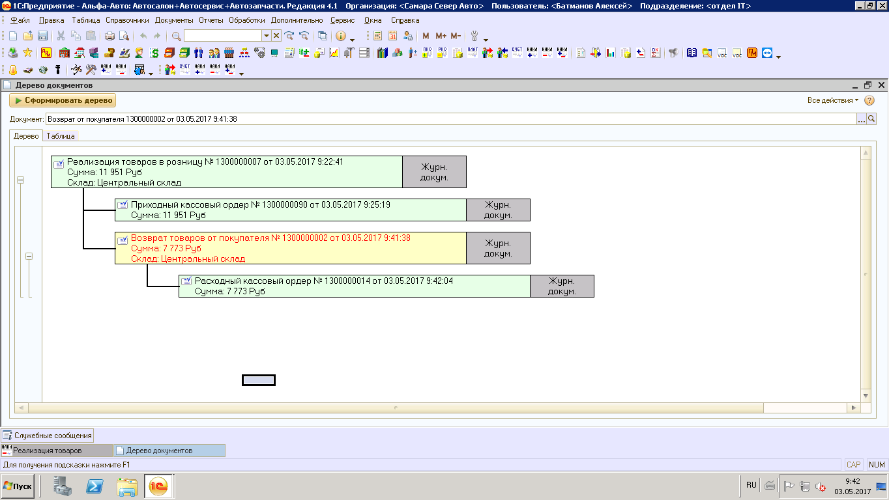
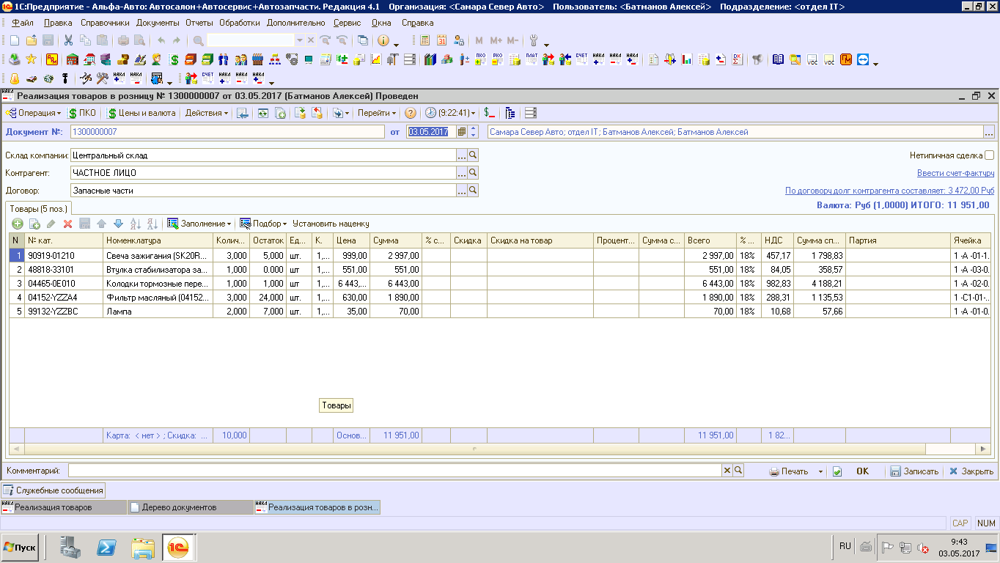
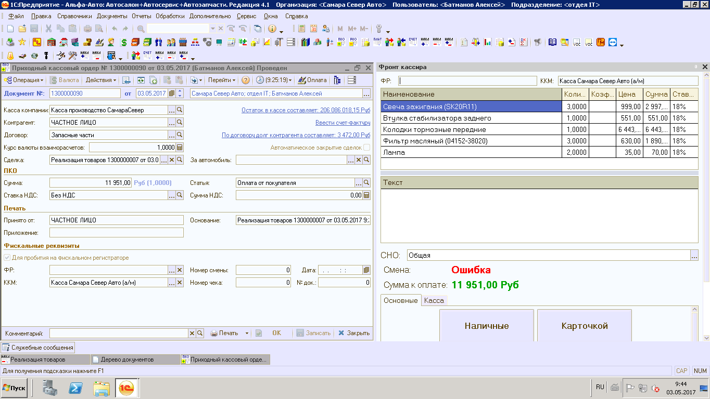
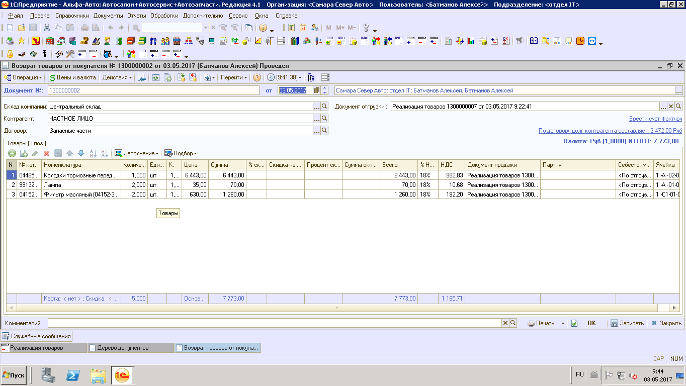
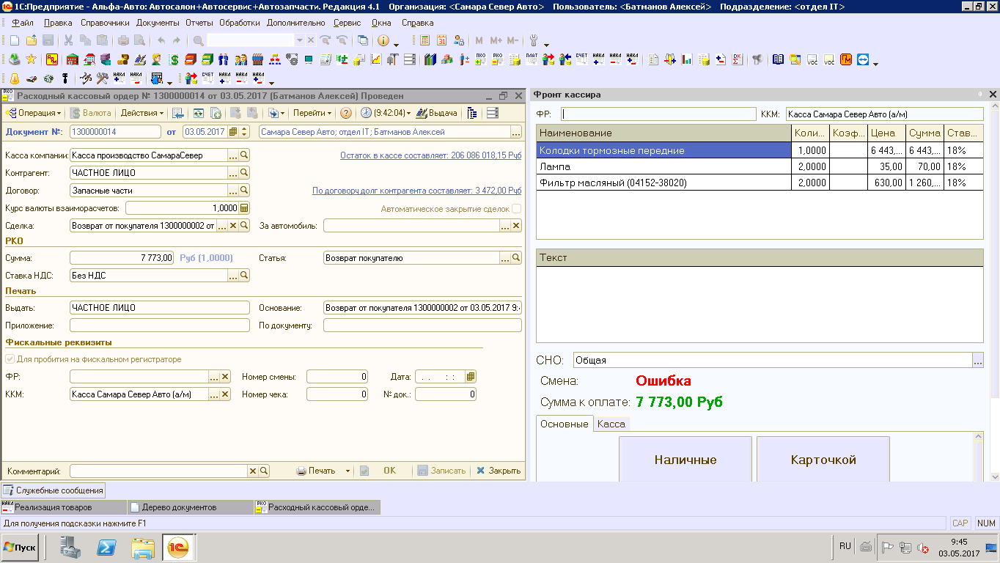

КАССЫ. ИНСТРУКЦИЯ № 5-02 от 30.10.2019. 
=======================================

Возврат покупателем ранее приобретенных товаров
-----------------------------------------------

Если Покупатель возвращает ранее приобретенный товар, то Дерево Связей
документов должно выглядеть согласно (Рисунок 1).

Пример : Оплата покупателем за товар происходит одним платежом на сумму,
равную документу «Реализация товаров».

Авансовые платежи не изменят порядок действий Кассира, а отразится в
интерфейсе Фронта кассира в виде соответствующих Наименований Платежей.

|image0|

Рисунок 1. Дерево связей документов при возврате товаров.

В примере Документ «\ **Реализация товаров**\ » с хоз. операцией
«\ **Реализация товаров в розницу**\ » содержит 5 наименований товаров
(Рисунок 2).

|image1|

Рисунок 2. Пример документа «Реализация товаров».

Кассир создает и проводит ПКО вводом на основании документа «Реализация
товаров» на сумму равную сумме по документу основания.

По кнопке «\ **Оплата»** в ПКО открывается интерфейс Фронта кассира
(Рисунок 3), в котором отображены наименования отгружаемых покупателю
товаров, их количество, цена за единицу, сумма и ставка НДС.

Кассир проверяет выбранную систему налогооблажения (СНО) и суммы к
оплате.

Кассир определяет форму оплаты (наличные либо карточка) и нажимает
кнопку **«Напечатать чек»….** далее Фронт кассира автоматически
закрывается и ККМ **распечатывает Кассовый Чек**.

|image2|

Рисунок 3. Фронт кассира при оплате по документу «Реализация товаров».

Документ **«Возврат товаров от покупателя»** оформляется при возврате
(частичном возврате) покупателем ранее приобретенных товаров (Рисунок
4).

Пример : Покупатель производит возврат 3 товарных позиций из 5 ранее
приобретенных.

Одна из позиций (Фильтр масляный), возвращается частично (было
приобретено 3 шт., а возвращается 2шт.).

|image3|

Рисунок 4. Пример документа «Возврат товаров от покупателя».

Кассир создает и проводит РКО вводом на основании проведенного документа
«Возврат товаров от покупателя» на сумму равную сумме по документу
основания.

По кнопке «Выдача» в РКО открывается интерфейс Фронта кассира (Рисунок
5), в котором отображены наименования возвращаемых покупателем товарных
позиций, их количество, цена за единицу, сумма и ставка НДС.

Кассир проверяет выбранную систему налогооблажения (СНО) и суммы к
возврату.

Кассир определяет форму возврата (наличные либо карточка) и нажимает
кнопку **«Напечатать** **чек».** ….. далее Фронт кассира автоматически
закрывается и ККМ **распечатывает Кассовый Чек** на возврат указанной
суммы.

|image4|

Рисунок 5. Фронт кассира при возврате денежных средств по документу
«Возврат товаров от покупателя».

История изменений с 01.11.2017

+-----------+-----------------+-----------------+-----------------+
| **Номер** | **Измененные    | **Описание      | **Версия        |
|           | разделы**       | изменений**     | утвержденного   |
|           |                 |                 | документа       |
|           |                 |                 | (дата)**        |
+-----------+-----------------+-----------------+-----------------+
|           |                 | Основное        | 01 (03.05.2017) |
|           |                 | наполнение      |                 |
|           |                 | документа       |                 |
+-----------+-----------------+-----------------+-----------------+
|           |                 | Внесены правки  | 02 (30.10.2019) |
|           |                 | по тексту       |                 |
+-----------+-----------------+-----------------+-----------------+
|           |                 |                 |                 |
+-----------+-----------------+-----------------+-----------------+

