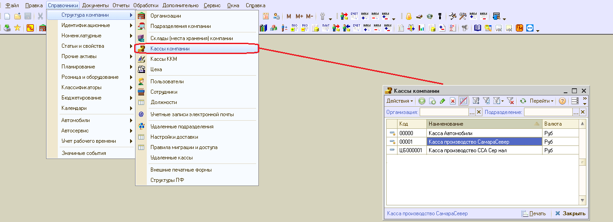
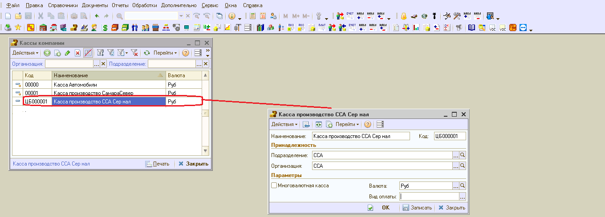
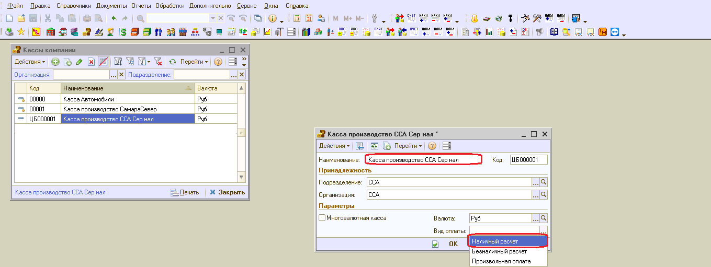
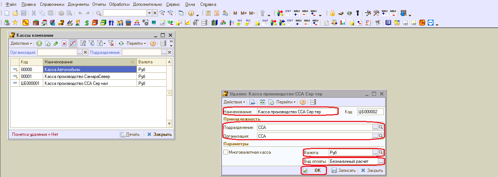
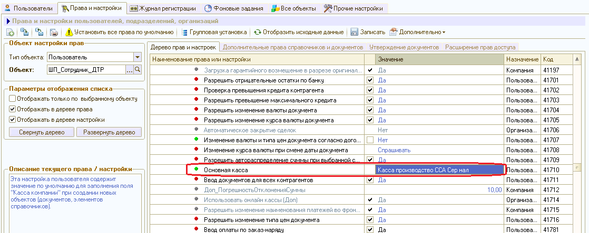
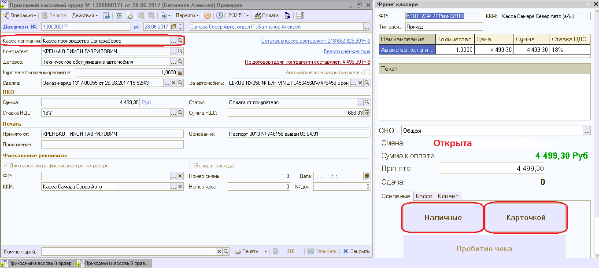
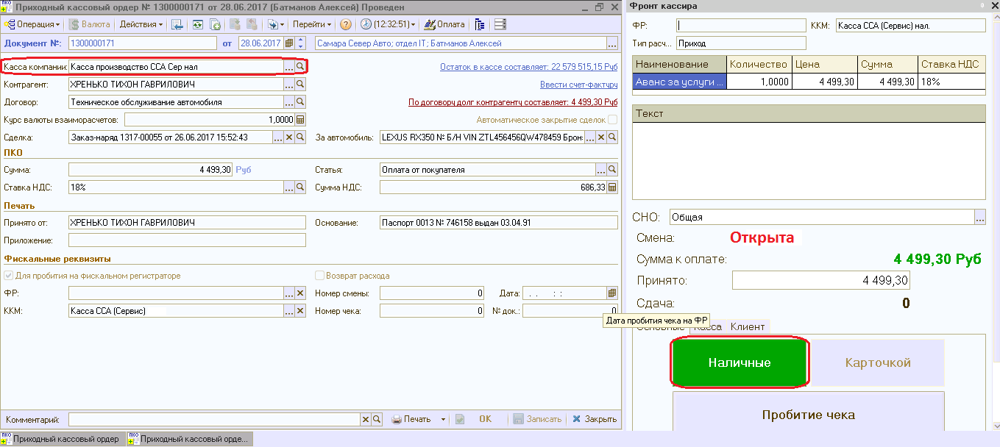
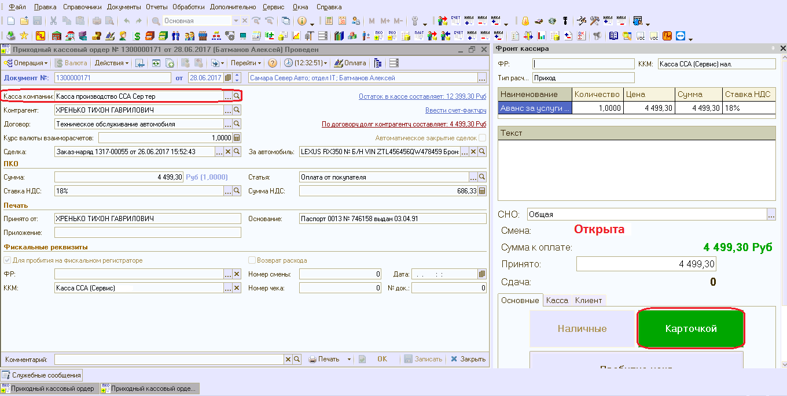

КАССЫ. ИНСТРУКЦИЯ № 6 от 10.07.2017 
===================================

Порядок работы фронта кассира при различных видах оплаты
---------------------------------------------------------

С целью разделения потоков денежных средств, проходящих через кассу, по
видам оплаты (наличные либо по банковской карте) необходимо:

1. Открыть справочник «Кассы компании» (Рисунок 1).

|image0|

Рисунок 1. Справочник «Кассы компании»

2. Осуществить контроль уже заведенных элементов и, при необходимости,
   внести корректировки в их настройки.

..

   Каждый элемент справочника (Касса компании) имеет реквизит
   «Организация» и если в дилерском центре 2 организации (продажа
   автомобилей и сервис), то элементов справочника должно быть не менее
   2-х. Если продажа автомобилей и сервисное обслуживание в дилерском
   центре осуществляется от имени одной организации, то в справочнике
   может присутствовать один элемент.

   Каждый элемент справочника имеет следующие реквизиты (Рисунок 2):

-  Наименование

-  Организация

-  Подразделение

-  Валюта

-  Вид оплаты

-  Многовалютная касса

|image1|

Рисунок 2. Реквизиты элемента справочника «Кассы компании».

Для настройки существующего элемента справочника «Кассы компании» на
прием наличных средств необходимо внести корректировки в поле
наименование для идентификации данной кассы в рамках характера ее
использования и указать вид оплаты – «Наличный расчет» (Рисунок 3).

|image2|

Рисунок 3. Настройка кассы компании на прием наличных средств.

3. Добавить в справочник «Кассы компании» новый элемент и осуществить
   его настройку для приема оплат по банковской карте (Рисунок 4):
   указать наименование, идентифицирующее кассу в рамках характера ее
   использования, указать принадлежность к организации и подразделению,
   указать валюту, указать вид оплаты – «Безналичный расчет».

|image3|

Рисунок 4. Настройка кассы компании на прием оплат с использованием
банковской карты.

1. При формировании платежного документа («Приходно-кассовый ордер» либо
   «Расходно- кассовый ордер») реквизит документа «Касса компании» по
   умолчанию заполняется элементом справочника «Касса компании», который
   в правах и настройках отмечен как «Основная касса», рисунок 5, вне
   зависимости от вида оплаты.

|image4|

Рисунок 5. Настройка Основная касса

2. Если в правах и настройках, в настройке Основная касса отсутствует
   выбранный элемент Кассы компании, то выбирается элемент, у которого
   вид оплаты равен «Произвольная оплата» либо данный реквизит не
   заполнен.

3. Ситуация по п. 3.1. и 3.2. применима для тех дилерских центров,
   которые не разделяют потоки денежных средств по видам оплат и не
   произвели настройку справочника «Кассы компании» по видам оплаты
   (Рисунок 6). В этом случае во Фронте кассира доступны для выбора обе
   кнопки выбора вида оплаты («Наличные» либо «Карточкой»).

|image5|

Рисунок 6. ПКО и Фронт кассира при отсутствии необходимости разделять

денежные потоки по видам оплаты.

4. Для дилерских центров, разделяющих потоки денежных средств по видам
   оплаты и произведшим настройку справочника «Кассы компании» при
   формировании платежного документа («Приходно-кассовый ордер» либо
   «Расходно-кассовый ордер») реквизит документа «Касса компании» по
   умолчанию заполняется «Кассой компании» отмеченной как Основная касса
   в правах и настройках вне зависимости от вида оплаты.

5. При отсутствии настройки по Основной кассе касса компании заполняется
   элементом справочника «Касса компании», у которого вид оплаты равен
   «Наличный расчет» (Рисунок 7). В этом случае во Фронте кассира
   доступна для выбора только одна кнопка выбора вида оплаты «Наличные».

|image6|

Рисунок 7. ПКО и Фронт кассира при приеме наличных платежей

6. В случае, когда клиент намерен оплатить услуги дилерского центра
   посредством использования банковской карты кассир в создаваемом
   приходно-кассовом ордере должен вручную изменить реквизит «Касса
   компании» на значение кассы с видом оплаты «Безналичный расчет»
   (Рисунок 8). Касса компании с видом оплаты «Безналичный расчёт»
   выбирается только вручную. В этом случае во Фронте кассира доступна
   для выбора только одна кнопка выбора вида оплаты «Карточкой».

|image7|

Рисунок 8. ПКО и Фронт кассира при приеме оплаты посредством

использования банковской карты

Аналогичным образом кассир должен поступать, если производится возврат
денежных средств и оформляется расходно-кассовый ордер относительно
ранее произведенных оплат банковской картой.

История изменений с 01.11.2017

+-----------+-----------------+-----------------+-----------------+
| **Номер** | **Измененные    | **Описание      | **Версия        |
|           | разделы**       | изменений**     | утвержденного   |
|           |                 |                 | документа       |
|           |                 |                 | (дата)**        |
+-----------+-----------------+-----------------+-----------------+
|           |                 | Основное        | 01 (10.07.2017) |
|           |                 | наполнение      |                 |
|           |                 | документа       |                 |
+-----------+-----------------+-----------------+-----------------+
|           |                 |                 |                 |
+-----------+-----------------+-----------------+-----------------+
|           |                 |                 |                 |
+-----------+-----------------+-----------------+-----------------+

