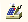

Кассы. ИНСТРУКЦИЯ № 9-04 от 02.12.2019
======================================

Кассовые Чеки по безналичным платежам физических лиц (работа с Банковской выпиской).
------------------------------------------------------------------------------------

1. Кассовый Чек пробиваем по Банковской выписке с хозоперациями:

..

   «Строка банковской выписки» и «Банковская выписка», рис 1, 2.

|image0|

Рисунок 1. Выбор журнала документов «Банковская выписка»

|image1|

Рисунок 2. Журнал документов «Банковская выписка»

2. *Исполнителю, по Выписке из Клиент-банка определить наличие в Выписке
   поступления/выплаты денежных средств от физического лица/физическому
   лицу. Создать в Программе1С: Альфа-авто банковскую выписку.*

3. *Выбрать в табличной части документа Сделку, на Приход и/или Расход
   по каждой из строк Выписки которую нужно пробить Кассовый Чек, и
   остальные реквизиты и провести Банковскую выписку, рисунок 3.*

..

   *Чек ККМ не пробивается, если сделка в табличной части Банковской
   выписки не заполнена (сделки - оплачиваемый документ отгрузки).*

   *При*\ **продажи автомобиля**\ *сделкой может быть Заказ клиента на
   автомобиль (при отсутствии Реализации автомобиля).*

|image2|

Рисунок 3. Сделка в документе Банковская выписка

4. **Назначение полей закладки «Пробитие чеков физлиц» в Банковской
   выписке.**

Новая закладка разделена на два поля, рисунок 4:

1 - общая часть (содержит четыре кнопки);

2 - табличная часть, с реквизитами, перечисленными в таблице 1.

|image3|

Рисунок 4. Закладка «Пробитие чеков физлиц» «Банковской выписки»

5. **Назначение и использование кнопок.**

5.1. В общей части (1) содержатся кнопки и поля, который относятся ко
всем строкам и к ККМ:

- по кнопке |image4| заполняются/отображаются реквизиты каждой строки Банковской выписки на закладке «Пробитие чеков физ лиц» в формате таблицы 1.

На закладку «Пробитие чеков физлиц» формируются строки только по
контрагентам, являющимся физическими лицами;

- по кнопке |image5| происходит переход к Фронту кассира для пробития Кассового Чека по текущей строке, на которой расположен курсор.

После печати Кассового Чека по выбранной строке эта строка окрашивается
в серый цвет, что указывает на блокировку строки, повторное пробить Чек
ККТ невозможно.

Чеки ККТ пробиваются построчно, за одно открытие Фронта кассира можно
пробить только один Кассовый Чек.

- по кнопке «Открыть фронт кассира»\ |image6| открывается Фронт кассира для оперативного открытия, закрытия, просмотра состояния смены непосредственно из банковской выписки.

Предварительно выбирается ККТ по которой необходимо открыть Фронт
кассира, рисунок 5.

|image7|

Рисунок 5. Выбор ККТ для открытия фронта кассира

- по кнопке |image8| добавляются две строки для исправления ошибочно пробитого Кассового Чека.

6. **Реквизиты табличной части закладки «Пробитие чеков физлиц»
   Банковской выписки.**

   1. В табличной части на закладке «Состав», рисунок 3, присутствует:

..

   «Сумма прихода» и «Сумма расхода».

Если одновременно указаны «Сумма прихода» и «Сумма расхода», на закладке
«Пробитие чеков физлиц» они преобразуются в две строки:

одна по «Сумме прихода» другая по «Сумме расхода».

2. В каждой строке табличной части содержатся реквизиты, приведённые в
   таблице 1.

..

   При пробивании Кассового Чека из Фронта кассира автоматически
   выделяется вид оплаты «Карточкой», пробитие Наличными невозможно.

Таблица 1 – Реквизиты табличной части закладки **Пробитие чеков физ
лиц**

+-------+--------------------+---------------------------------------+
| **№** | **Реквизит**       | **Описание логики отображения и       |
|       |                    | применения**                          |
+=======+====================+=======================================+
| 1     | Коррекция          | Признак указывающий корректировалась  |
|       |                    | ли строка. «Исходная» - если Чек ККТ  |
|       |                    | пробит штатно и данную строку         |
|       |                    | исправляют.                           |
|       |                    |                                       |
|       |                    | «Сторно» - строка для пробития        |
|       |                    | обратного Чека ККТ.                   |
|       |                    |                                       |
|       |                    | «Новая» - строка для пробития         |
|       |                    | правильного Чека ККТ.                 |
+-------+--------------------+---------------------------------------+
| 2     | Контрагент         | Перемещается из закладки «Состав».    |
+-------+--------------------+---------------------------------------+
| 3     | Договор            |                                       |
+-------+--------------------+---------------------------------------+
| 4     | Сделка             |                                       |
+-------+--------------------+---------------------------------------+
| 5     | Сумма приход       |                                       |
+-------+--------------------+---------------------------------------+
| 6     | Сумма расход       |                                       |
+-------+--------------------+---------------------------------------+
| 7     | Ставка НДС         |                                       |
+-------+--------------------+---------------------------------------+
| 8     | Сумма НДС          |                                       |
+-------+--------------------+---------------------------------------+
| 9     | ФР                 | Аналогично ПКО/РКО                    |
+-------+--------------------+---------------------------------------+
| 10    | Дата ФР            |                                       |
+-------+--------------------+---------------------------------------+
| 11    | Для пробития на ФР |                                       |
+-------+--------------------+---------------------------------------+
| 12    | Номер документа    |                                       |
+-------+--------------------+---------------------------------------+
| 13    | Номер смены        |                                       |
+-------+--------------------+---------------------------------------+
| 14    | Номер чека         |                                       |
+-------+--------------------+---------------------------------------+
| 15    | Тип расчёта        | Принимает значения:                   |
|       |                    |                                       |
|       |                    | «Приход» и «Возврат расхода», если    |
|       |                    | указана Сумма прихода;                |
|       |                    |                                       |
|       |                    | «Возврат прихода» и «Расход», если    |
|       |                    | указана Сумма расхода.                |
+-------+--------------------+---------------------------------------+

7. Для пробития кассового чека/чеков из Банковской выписки необходимо:

   1. Нажать кнопку «Подготовить данные чеков»;

   2. Расположить курсор в строке, которую будем пробивать;

   3. Проверить все реквизиты в табличной части;

   4. При необходимости изменить реквизит **Тип расчёта**.

..

   Если указана **Сумма прихода**, по умолчанию значение реквизита
   **«Приход»,** можно изменить на **«Возврат расхода**\ ».

   Если указана **Сумма расхода**, по умолчанию значение реквизита
   «\ **Возврат прихода»,** можно при необходимости сменить на
   **«Расход**\ ».

5. Нажать кнопку **«Пробить чек»** и перейти к Фронту кассира;

6. Проверить и при необходимости изменить реквизиты:

..

   СНО; Сумма к оплате; E-mail; Телефон; Кассир; Наименование;
   Количество; Цена; Сумма; Ставка НДС; поле Текст (полная стоимость и
   Зачёт аванса).

   При внесении изменений принцип выбора реквизитов аналогичен
   пробиванию Кассовых Чеков из ПКО/РКО. (См. «Кассы. ИНСТРУКЦИЯ № 1.
   Основные правила печати кассовых чеков»);

1. Поле СНО определяем по документу Сделки.

Тип расчёта ДС определяется по Типу расчёта в Банковской выписке.

ККМ определяется по организации.

7. Пробить Кассовый Чек по инструкции «Кассы. ИНСТРУКЦИЯ № 1. «Основные
   правила печати кассовых чеков».

8. Выбрать строку для пробития и повторить описанную последовательность
   действий.

9. В журнале Банковской выписки в столбце «Всего/Пробито» после пробития
   отображается информация, сколько строк выписки пробито из общего
   количества строк, (рисунок 6).

..

   |image9|

   Рисунок 6. Информация в журнале банковской выписки о пробитых строках

8. **Пробитие Кассовых Чеков по безналичному расчёту при реализации**

   **автомобилей Trade-in.**

..

   Автомобили Trade-in приобретены для перепродажи у физических лиц
   (автомобиль приобретается у прежнего владельца и продаётся новому
   владельцу).

   **При поступлении оплаты за автомобиль, когда сумма НДС исчисляется
   не со всей поступившей суммы, необходимо создавать в банковской
   выписке две строки и пробивать двумя Кассовыми Чеками (обусловлено
   передачей в кассовый аппарат ставки НДС, а не суммы НДС).**

1. Пример: Автомобиль Trade-in поступил за 1 500 000 рублей. Новому
   клиенту продаём за 1 700 000 рублей.

   1. Первый Чек ККТ пробить на межценовую разницу со ставкой НДС
      20/120.

..

   Создать строку Банковской выписки, указать сумму прихода 200 000
   рублей, ставку НДС 20/120 и сумму НДС, (рисунок 7).

**Важно! При реализации автомобилей, приобретённых у физических лиц для
перепродажи,**

**налоговая база определяется как разница между ценой реализации с
учётом НДС и**

**ценой приобретения таких автомобилей (межценовая разница).**

-  В документах найти «Заказ клиента на автомобиль».

..

   Найти документ «Поступление автомобиля Trade-in» по «Заказу клиента
   на автомобиль». Определить сумму поступления автомобиля.

-  Рассчитать межценовую разницу. (межценовая разница равна (=) Сумме
      реализации автомобиля минус (-) Сумма поступления автомобиля).

|image10|

Рисунок 7. Банковская выписка (случай межценовой разницы)

1. Второй Чек ККТ пробить на сумму оплаты, равную цене выкупа автомобиля
   автоцентром со ставкой «Без НДС».

..

   Создать строку Банковской выписки, указать сумму прихода 1 500 000
   рублей и ставку «Без НДС», сумму НДС равную нулю, (рисунок 7).

**Важно!** Цена выкупа автомобиля определяется по «Поступлению
автомобиля Trade-in».

2. Перейти на вкладку «Пробитие чеков физлиц»;

3. Нажать кнопку «Подготовить данные чеков»;

4. Расположить курсор в строке со ставкой НДС 20/120, (рисунок 8).

|image11|

Рисунок 8. Закладка Пробитие чеков физлиц, строка со ставкой НДС 20/120

1. Проверить по выбранной строке все реквизиты в табличной части.

2. Нажать кнопку «Пробить чек» и перейти к Фронту кассира, проверить
   СНО, (рисунок 9).

3. Проверить Наименование платежа и признаки предмета и способа расчёта
   во Фронте кассира, должно быть в зависимости от проведённого
   документа «Реализация автомобиля»:

-  **проведён и был ранее пробит нулевой Чек отгрузки - «А/М Модель VIN»,** (рисунок 9)

   -  **Признак способа расчёта: Оплата кредита;**

   -  **Признак предмета расчёта: Платёж, выплата;**

-  **НЕ проведён и не было нулевого Чека отгрузки - «Аванс за автомобиль»,** (рисунок 10)

   -  **Признак способа расчёта: Аванс;**

   -  **Признак предмета расчёта: Платёж, выплата**.

|image12|

Рисунок 9. Фронт кассира при открытии по строке со ставкой НДС 20/120
(пробитие после чека отгрузки)

1. Пробить кассовый чек по кнопке «\ **Пробитие чека».**

|image13|

Рисунок 10. Фронт кассира при открытии по строке со ставкой НДС 20/120
(пробитие до чека отгрузки)

1. Расположить курсор в строке на сумму оплаты, равную цене выкупа
   автомобиля автоцентром, (рисунок 11).

|image14|

Рисунок 11. Закладка Пробитие чеков физлиц, строка на сумму оплаты,
равная цене выкупа автомобиля

1. Проверить по выбранной строке все реквизиты в табличной части.

2. Нажать кнопку «\ **Пробить чек»** и перейти к Фронту кассира,
   проверить СНО, рисунок 12.

3. Проверить Наименование платежа и признаки предмета и способа расчёта
   во Фронте кассира, должно быть в зависимости от проведённого
   документа «Реализация автомобиля»:

-  **проведён и был ранее пробит нулевой Чек отгрузки - «А/М Модель VIN»,** (рисунок 12)

   -  **Признак способа расчёта: Оплата кредита;**

   -  **Признак предмета расчёта: Платёж, выплата;**

-  **НЕ проведён и не было нулевого Чека отгрузки - «Аванс за автомобиль»,** (рисунок 13)

   -  **Признак способа расчёта: Аванс;**

   -  **Признак предмета расчёта: Платёж, выплата**.

      1. Пробить кассовый чек по кнопке «\ **Пробитие чека**\ ».

|image15|

Рисунок 12. Фронт кассира, строка на сумму оплаты, равная цене выкупа
автомобиля (пробитие после чека отгрузки)

|image16|

Рисунок 13. Фронт кассира, строка на сумму оплаты, равная цене выкупа
автомобиля (пробитие до чека отгрузки)

9. **Пробитие Кассовых Чеков по безналичному расчёту при исправлении
   ошибок.**

   1. При исправлении неправильно пробитых Кассовых Чеков использовать
      ту же Банковскую выписку, из которой был пробит неправильный Чек
      ККТ.

   2. Функция исправления доступна, если Кассовый Чек по строке был
      пробит (строка закрашена серым цветом), рисунок 14.

   3. Поместить курсор на строке, которая исправляется, рисунок 14.

   4. Нажать кнопку **«Ввести чеки исправления**\ », рисунок 14.

..

   Кнопка доступна для пользователей с правом «\ **Исправление чеков
   банковской выписки».**

|image17|

   Рисунок 14. Строка в банковской выписке, по которой необходимо
   исправить неправильно пробитый чек.

1. При нажатии на кнопку «\ **Ввести чеки исправления**\ », на которой
   находится курсор, создаётся две строки, (рисунок 15):

- Первая с признаком «Сторно»,

- Вторая с признаком «Новая» в столбце «Коррекция», (рисунок 15).

|image18|

Рисунок 15. Формирование строки «Сторно» и «Новая» при подготовке
пробития Чеков ККТ

для исправления.

1. Для строки с признаком «Сторно» реквизиты табличной части (поле 2)
   наследуются полностью, кроме «Типа расчёта» (рисунок 15).

..

   Поле «Тип расчёта» меняется на противоположное значение, (таблица 3).

   Значения полей «\ **Сумма прихода**\ » и «\ **Сумму расхода**\ »
   меняются местами относительно исходной строки.

   **Таблица 3 – Реквизит «Тип расчёта» при исправлении Чеков ККТ**

+----------------------+----------------------+----------------------+
| Тип расчёта          |                      |                      |
+======================+======================+======================+
| «Исходная» строка    | Строка «Сторно»      | Строка «Новая»       |
+----------------------+----------------------+----------------------+
| **Приход** денежных  | **Возврат** денежных | **Приход** денежных  |
| средств              | средств              | средств              |
+----------------------+----------------------+----------------------+
| **Возврат** денежных | **Приход** денежных  | **Возврат** денежных |
| средств              | средств              | средств              |
+----------------------+----------------------+----------------------+
| **Расход** денежных  | **Возврат расхода**  | **Расход** денежных  |
| средств              | денежных средств     | средств              |
+----------------------+----------------------+----------------------+
| **Возврат расхода**  | **Расход** денежных  | **Возврат расхода**  |
| денежных средств     | средств              | денежных средств     |
+----------------------+----------------------+----------------------+

2. В строке с признаком «\ **Новая»** реквизиты табличной части (поле
   2), наследуются полностью, (рисунок 14).

«\ **Тип расчёта**\ » соответствует «Типу расчёта» в «Исходной строке»,
таблица 3.

**«Сумма прихода»** и **«Сумма расхода»** соответствуют значениям
**«Исходной»** строки. Относительно **«Исходной**\ » строки в строке
«\ **Новая»** дополнительно становятся активными для исправления
реквизиты: «Сумма приход»; «Сумма расход»; «Ставка НДС»; «Сумма НДС»,
редактирование доступно пользователям с правом «Исправление чеков
Банковской выписки».

2. Исправить **«Исходную»** строку, нажать кнопку |image19| допускается
   только один раз.

Возможность повторного исправления появляется, только если «пробиты» как
Кассовые Чеки все три строки «Исходная», «Сторно», «Новая».

Признак «Исходная» появляется в столбце «Коррекция», если данная строка
исправляется. До момента копирования поле «Коррекция» пустое.

5. Пробить Кассовые Чеки для исправления, действуя в соответствии с п.
   7.2 – 7.8.

10. **История изменений**

+-----------+-----------------+-----------------+-----------------+
| **Номер** | **Измененные    | **Описание      | **Версия        |
|           | разделы**       | изменений**     | утвержденного   |
|           |                 |                 | документа       |
|           |                 |                 | (дата)**        |
+===========+=================+=================+=================+
| **1**     |                 | Основное        | 01 (30.06.2018) |
|           |                 | наполнение      |                 |
|           |                 | документа       |                 |
+-----------+-----------------+-----------------+-----------------+
| **2**     |                 | Добавлен раздел | 02 (04.07.2018) |
|           |                 | 8.              |                 |
|           |                 | Скорректирована |                 |
|           |                 | нумерация       |                 |
|           |                 | разделов        |                 |
+-----------+-----------------+-----------------+-----------------+
| **3**     |                 | Внесены         | 03 (24.10.2018) |
|           |                 | многочисленные  |                 |
|           |                 | правки по       |                 |
|           |                 | тексту.         |                 |
|           |                 | Добавлены       |                 |
|           |                 | изменения       |                 |
|           |                 | касательно      |                 |
|           |                 | пробития        |                 |
|           |                 | кассового чека  |                 |
|           |                 | с               |                 |
|           |                 | использованием  |                 |
|           |                 | фронта кассира. |                 |
|           |                 | Внесены         |                 |
|           |                 | изменения в     |                 |
|           |                 | рисунки,        |                 |
|           |                 | скорректирована |                 |
|           |                 | таблица 1,      |                 |
|           |                 | удалена таблица |                 |
|           |                 | 2. Добавлен     |                 |
|           |                 | раздел 9.       |                 |
+-----------+-----------------+-----------------+-----------------+
| **4**     |                 | Внесены правки  | 04 (02.12.2019) |
|           |                 | по тексту       |                 |
+-----------+-----------------+-----------------+-----------------+

..

   Инструкции по ККТ размещены по адресу:
   `https://yadi.sk/d/DavISnLYMGRka <https://mx.a-holding.ch/OWA/redir.aspx?C=6c2ee74b25f24f3bb6c102266faf8d32&URL=https%3A%2F%2Fyadi.sk%2Fd%2FDavISnLYMGRka>`__\ .

.. |image4| image:: instr9_image/media/image5.png
   :width: 1.73611in
   :height: 0.24792in

