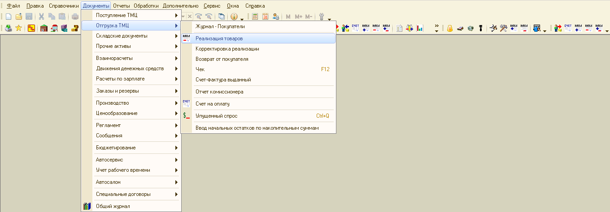
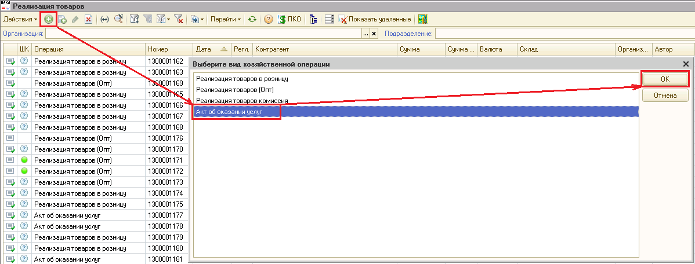
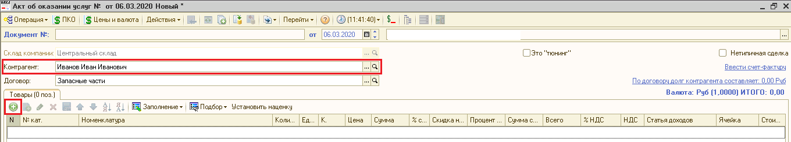
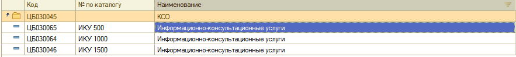
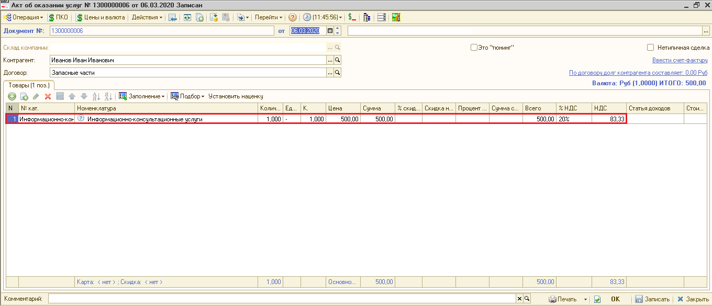
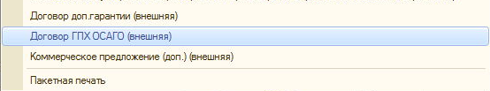

КАССЫ. ИНСТРУКЦИЯ № 18-02 от 17.03.2020
=======================================

Подготовка документа «Акт об оказании услуг» для оплаты Информационно-консультационных услуг в кредитно-страховом отделе
------------------------------------------------------------------------------------------------------------------------

1. Необходимо открыть журнал документов «Реализация товаров», рисунок 1. Документы – Отгрузка ТМЦ – Реализация товаров. Или Сервис – Все операции – Документы – Реализация товаров. 

Рисунок 1. Открытие журнала «Реализация товаров»

2. Создать документ с хозоперацией «Акт об оказании услуг», рисунок 2.

Рисунок 2. Создание документа Акт об оказании услуг

3. В созданном документе Акт об оказании услуг необходимо указать Контрагента из справочника «Контрагенты», если его там нет, то завести, рисунок 3. Нажать кнопку плюс для выбора номенклатуры, рисунок 3.

Рисунок 3. Заполнение Контрагента в Акте об оказании услуг

4. Выбрать в открывшемся справочнике «Номенклатура» Информационно-консультационные услуги из папки КСО, рисунок 4. В колонке «№ по каталогу» отражается цена той строки информационно-консультационной услуги, которая попадёт в документ при выборе строки.

Рисунок 4. Выбор информационно-консультационных услуг из справочника Номенклатуры

5. Заполнить табличную часть документа: 
- количество =1; 
- ввести сумму информационно-консультационных услуг. 
Проверить заполнение полей: цена = всего = сумма. Проверить ставку НДС 20% и сумму НДС в поле НДС, рисунок 5.

Рисунок 5. Заполнение документа Акт об оказании услуг

6. Провести документ по кнопке .
7. Распечатать из документа договор, рисунок 6.

Рисунок 6. Выбор договора.
    
8. Распечатать из документа «Акт об оказании услуг» по кнопке «Печать» Товарный чек  при оплате наличными для идентификации кассиром оплачиваемого документа. Товарный чек оставлять у кассира.
История изменений с 06.03.2020

.. csv-table:: История изменений
   :header: "Номер", "Измененные разделы", "Описание изменений", "Версия утвержденного  документа (дата)" 
   :widths:  10,  10,  30,  15

   , , Основное наполнение документа, 01 (06.03.2020)
   , , Скорректирован п. 4 и рисунок 4, 02 (17.03.2020) 
